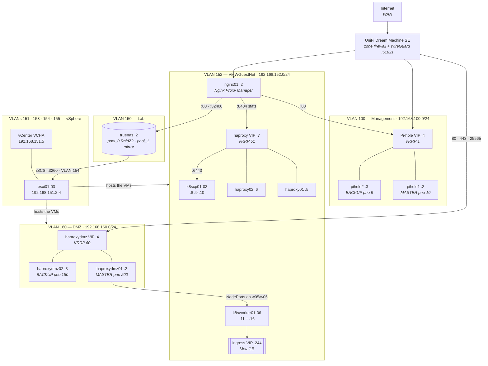

# homelab-infrastructure

> Config snapshots pulled off every live homelab host that Flux does not manage — for drift
> detection, disaster recovery, and reference.

Everything the Vollminlab homelab runs on that is *not* a Kubernetes workload lives here as a
read-only snapshot: Pi-hole, HAProxy, keepalived, Nginx Proxy Manager, TrueNAS, the UDM SE, vSphere,
and the kubeadm-level cluster state that the GitOps repo deliberately does not track. The snapshots
are pulled by five collectors and committed by hand, so a `git diff` after a collection run *is* the
drift report.

The important thing to understand before touching anything: **this repo is downstream of the live
hosts, never upstream of them.** Nothing here is applied back. The one exception is
`scripts/deploy-pihole-flask-api.sh`, which is a deploy tool that happens to live next to the
collectors.

---

## Architecture

The topology below is assembled from `hosts/udm/udapi-net-cfg.json`, the collected
`keepalived.conf` / `haproxy.cfg` files, `hosts/vsphere/`, and `hosts/truenas/`. VLAN numbering and
subnets are the UDM SE's.



Full VLAN table, firewall zone policy, WireGuard peers, DNS record inventory, and per-component DR
notes are in [`docs/infrastructure.md`](docs/infrastructure.md).

---

## Repository layout

```
hosts/            One directory per host or system — the collected snapshots
  ansible01/      Ansible control node — version + Galaxy inventory + bootstrap/DR README
  devsbx01/       Dev sandbox VM — shell configs + manual bootstrap notes
  groupme01/      GroupMe bridge — systemd unit, fstab
  haproxy01/      Internal HAProxy + keepalived — VRRP 51 MASTER
  haproxy02/      Internal HAProxy + keepalived — VRRP 51 BACKUP
  haproxydmz01/   DMZ HAProxy + keepalived — VRRP 60 MASTER, plus the LE cert sync script
  haproxydmz02/   DMZ HAProxy + keepalived — VRRP 60 BACKUP
  k8s/            kubeadm ClusterConfiguration, kubelet config, node inventory
  nginx01/        Nginx Proxy Manager — docker-compose + the NPM API export
  pihole1/        Pi-hole primary — pihole.toml, adlists, keepalived, nebula-sync, systemd, cron
  pihole2/        Pi-hole secondary — mirror of pihole1
  truenas/        TrueNAS SCALE — pools, datasets, SMB/NFS shares, services, cronjobs
  udm/            UniFi Dream Machine SE — udapi-net-cfg.json, redacted
  vsphere/        vCenter — 19 JSON exports covering compute, network, storage, RBAC
  windows/        Windows admin workstation — SSH config + public keys
scripts/          Collectors and utilities
docs/             Reference and runbooks
.claude/rules/    Agent rules — currently SSH only
```

`hosts/ansible01/README.md` and `hosts/devsbx01/README.md` carry their own bootstrap/DR write-ups;
`hosts/pihole2/NOTE.md` records that pihole2 is a mirror of pihole1.

---

## Collectors

Run everything in sequence from a terminal where the 1Password SSH agent is active:

```bash
bash scripts/collect-all.sh
```

Order is SSH hosts → NPM → TrueNAS → Kubernetes → vSphere, followed by a `git diff --stat` so the
drift is the last thing on screen. **Nothing is scheduled** — there is no cron entry and no GitHub
Actions workflow in this repo. Collection is a deliberate, reviewed act.

| Script | Transport | Targets | Writes to |
|---|---|---|---|
| `collect-host-configs.sh` | SSH, one session per host | `pihole1` `pihole2` `groupme01` `haproxy01` `haproxy02` `haproxydmz01` `haproxydmz02` `nginx01` `ansible01` `udm` | `hosts/<host>/` |
| `collect-npm-configs.sh` | NPM REST API, `http://npm.vollminlab.com:81` | nginx01 | `hosts/nginx01/npm/*.json` |
| `collect-truenas-configs.sh` | TrueNAS REST v2.0, `https://truenas.vollminlab.com` | truenas | `hosts/truenas/*.json` |
| `collect-k8s-configs.sh` | local `kubectl` / `~/.kube/config` | cluster | `hosts/k8s/*.yaml` |
| `Export-VSphereConfigs.ps1` | PowerCLI → `vcenter.vollminlab.com` | vSphere | `hosts/vsphere/*.json` |

Individual runs, including a single host:

```bash
bash scripts/collect-host-configs.sh            # every SSH host
bash scripts/collect-host-configs.sh pihole1    # just one
bash scripts/collect-npm-configs.sh
bash scripts/collect-truenas-configs.sh
bash scripts/collect-k8s-configs.sh
powershell.exe -NoProfile -ExecutionPolicy Bypass -File scripts/Export-VSphereConfigs.ps1
```

Then review and commit:

```bash
git diff --stat
git diff
git add -p
git commit
```

### Utilities

| Script | Purpose |
|---|---|
| `generate-vm-inventory.py` | Regenerates the VM inventory tables in `docs/infrastructure.md` from `hosts/vsphere/vms.json`. `--check` exits non-zero if the doc is stale. |
| `deploy-pihole-flask-api.sh` | `git pull` + `systemctl restart pihole-flask-api` on both Pi-holes. `--dns` also POSTs A records to both `:5001` APIs. The only script here that writes to a live host. |

### Per-host collection: what each collector reaches for

Every SSH host gets the same base set — `/etc/fstab`, non-stock units from
`/etc/systemd/system/*.{service,timer}`, text files in `/usr/local/bin/`, and both root and
`vollmin` crontabs. On top of that:

| Host | Additional files |
|---|---|
| `pihole1` / `pihole2` | `/etc/pihole/*.toml` and `*.list`, `/etc/pihole-flask-api/.env`, `/etc/keepalived/keepalived.conf` |
| `pihole1` only | `~/nebula-sync/docker-compose.yml` and `.env` |
| `haproxy0*` / `haproxydmz0*` | `/etc/haproxy/haproxy.cfg`, `/etc/keepalived/keepalived.conf` |
| `nginx01` | `~/nginx-proxy-manager/docker-compose.yml` |
| `ansible01` | `ansible --version`, `ansible-galaxy collection list`, `ansible-galaxy role list`, `/etc/ansible/ansible.cfg` |
| `udm` | `/data/udapi-config/udapi-net-cfg.json`, redacted and pretty-printed locally |

---

## Sharp edges

**One SSH session per host, not one per file.** Each collector pipes a self-contained remote script
into `ssh <host> bash` and streams every file back in a delimited protocol —
`<<<FILE rel/path>>> … <<<ENDFILE>>>` — which the local `parse_remote()` unpacks into
`hosts/<host>/`. This exists so the 1Password SSH agent prompts **once per host** instead of once
per file. If you add a file to collect, add it to the remote `emit` list; do not add an `scp`.

**Git Bash's `ssh` cannot reach the 1Password agent.** The bundled binary can't talk to the Windows
named pipe `\\.\pipe\openssh-ssh-agent`, so every script starts with
`export PATH="/c/Windows/System32/OpenSSH:$PATH"`. Without it you get `Permission denied (publickey)`
even though your interactive shell works fine. The line is a harmless no-op on Linux. See
[`.claude/rules/ssh.md`](.claude/rules/ssh.md).

**LF is enforced repo-wide.** `.gitattributes` sets `* text=auto eol=lf`, and every JSON writer
explicitly emits LF (`newline='\n'` in Python, an explicit `\r\n` → `\n` replace in PowerShell).
These are Linux systemd units and shell scripts; CRLF would corrupt them on restore, and it also
makes every collection run show as a whole-file diff.

**Missing sudo degrades, it does not fail.** The generic, HAProxy, `nginx01`, `groupme01`, and
`ansible01` collectors try `sudo -n cat` and fall back to plain `cat`, emitting
`SKIPPED (permission denied)` on stderr rather than aborting. To unlock the HAProxy configs, the
sudoers line is in the comment block above `collect_haproxy()` in `collect-host-configs.sh`. The
Pi-hole collector is the exception — it runs the whole remote script under `sudo bash -s`.

**Pi-hole drift is checked automatically, but only when both hosts are collected.** If the run
includes `pihole1` *and* `pihole2`, `verify_pihole_sync()` diffs every collected file and prints
`DRIFT:` / `MISSING on pihole2:` lines. `keepalived`, `nebula-sync`, and `fstab` are excluded by
design — different hardware means different PARTUUIDs, and the HA configs are meant to differ.
`app_pwhash` and `Last updated` comments are filtered out of the diff as expected noise.

**The VM inventory in `docs/infrastructure.md` is generated.** The tables between the
`<!-- BEGIN GENERATED: vm-inventory -->` markers come from `hosts/vsphere/vms.json` — hand-edits are
overwritten. ESXi host and datastore placement are deliberately omitted: DRS relocates VMs on its
own, so recording placement in a doc only guarantees drift.

**Empty crontabs are deleted, not committed.** `prune_empty_crontabs()` removes any `crontab-*` file
containing nothing but comments and blank lines, so an absent file means "no cron jobs", not "not
collected".

---

## Secrets

No credential values are stored in this repo, and the collectors are built on the assumption that
they never will be. Three independent mechanisms:

**1. Redaction at collection time.** Each collector strips known-sensitive fields before the file
lands on disk:

| Collected artifact | Redacted |
|---|---|
| `configs/pihole/*.toml` | `pwhash` |
| `configs/pihole-flask-api/.env` | `PIHOLE_API_KEY` |
| `configs/keepalived/keepalived.conf` | `auth_pass` |
| `configs/haproxy/haproxy.cfg` | the password half of `stats auth user:pass` |
| `nebula-sync/.env` | any key matching pass / token / key / secret, plus the API key in `PRIMARY=` and `REPLICAS=` URLs |
| `udm/udapi-net-cfg.json` | JSON keys `password` `secret` `x_passphrase` `x_wpa_psk` `x_password` `private_key` `privateKey` `token` `key` `username` |
| `truenas/*.json` | `privatekey`, `certificate`, and any list containing a `-----BEGIN` PEM block |
| `nginx01/npm/*.json` | `dns_provider_credentials`, `letsencrypt_email`, `email` |

**2. `.gitignore` as the backstop.** `.env` and `*.env` are ignored outright. The redacted `.env`
files the Pi-hole collector pulls therefore exist in your working tree after a run but are **never
committed** — only the `*.env.example` templates are tracked. Treat any `.env` under `hosts/` as
local scratch.

**3. Categorical exclusions.** Some things are never fetched at all:

| Not collected | Why |
|---|---|
| Pi-hole databases — `gravity.db`, `pihole-FTL.db` | The collector matches `*.toml` and `*.list` only. Databases are regenerable state, not config. |
| Pi-hole TLS certificate `/etc/pihole/tls.pem` | Self-signed and regenerated on rebuild — see [`docs/pihole-tls.md`](docs/pihole-tls.md). |
| SSH private keys | `hosts/windows/ssh/` holds `.pub` files only, as identity hints for `IdentitiesOnly yes`. Private keys live in 1Password. |
| Ansible inventory, `host_vars`, playbooks, project `ansible.cfg` | Their source of truth is the `ansible-playbooks` repo. `ansible01/` records only runtime state that exists nowhere else. |
| NPM proxy definitions as files | They live in MariaDB; `collect-npm-configs.sh` exports them through the API instead. |
| Binaries in `/usr/local/bin` | Filtered with `grep -qI` so only text scripts are pulled. |
| Stock OS and Pi-hole systemd units | Filtered by the `SKIP` regex — `ssh`, `cron`, `systemd-*`, `pihole-FTL`, `open-vm-tools`, and friends. |
| vCenter VCHA appliance VMs | Managed out of band; excluded from the generated VM inventory. |

Credentials come from 1Password (`Homelab` vault) via the `op` CLI at runtime. The collectors look
up their own credentials by item ID and prompt interactively only when `op` is missing.

---

## Disaster recovery

This repo answers "what was it configured as" — it is not a restore tool. The workflow is: rebuild
the host from its OS installer or a vSphere template, copy the collected config back into place,
then re-fetch the redacted values from 1Password. Per-component notes are under **DR Notes** in
[`docs/infrastructure.md`](docs/infrastructure.md); the summary:

| Component | Restore path |
|---|---|
| **Pi-hole** | Reinstall, restore `pihole.toml`, restart FTL. nebula-sync re-replicates pihole1 → pihole2. TLS cert must be regenerated. |
| **HAProxy / keepalived** | Stateless. Drop `haproxy.cfg` + `keepalived.conf` back in place and un-redact `auth_pass` and the stats password from 1Password. |
| **Nginx Proxy Manager** | `docker-compose up` from `hosts/nginx01/docker-compose.yml`, then re-import proxy hosts from `hosts/nginx01/npm/`. |
| **TrueNAS** | Pool layout, datasets, and share definitions are captured — but pools depend on the physical disk layout, which this repo cannot recreate. |
| **vSphere** | `hosts/vsphere/` is a reference snapshot for rebuilding cluster, DVS, port groups, and iSCSI. vCSA itself restores from its file-based backup on the TrueNAS NFS export. |
| **Kubernetes** | Flux re-bootstraps every workload from `k8s-vollminlab-cluster`. `hosts/k8s/` holds the kubeadm-level state Flux does not track. etcd backup/restore is in [`docs/etcd.md`](docs/etcd.md). |
| **ansible01** | Full rebuild procedure in [`hosts/ansible01/README.md`](hosts/ansible01/README.md) — including the on-disk outbound SSH key, which is *not* brokered by the 1Password agent. |
| **devsbx01** | Bootstrap steps and shell configs in [`hosts/devsbx01/README.md`](hosts/devsbx01/README.md). |

---

## Docs

| Doc | Contents |
|---|---|
| [`infrastructure.md`](docs/infrastructure.md) | The reference. VLANs, firewall zones, WireGuard, DNS records, ESXi/vCenter, VM inventory, HAProxy backends, TrueNAS pools, DR notes. |
| [`maintenance-day.md`](docs/maintenance-day.md) | The coordinated upgrade window — TrueNAS → ESXi → VMs → Kubernetes, in dependency order. |
| [`etcd.md`](docs/etcd.md) | Backup, restore, and member replacement for the stacked etcd cluster. |
| [`ssh-setup.md`](docs/ssh-setup.md) | 1Password SSH agent setup, host aliases, key layout. |
| [`credential-rotation.md`](docs/credential-rotation.md) | Which credentials expire, and how to rotate each. |
| [`pihole-tls.md`](docs/pihole-tls.md) | Regenerating the self-signed EC cert for the Pi-hole web UI. |
| [`pihole-hardware.md`](docs/pihole-hardware.md) | SD card health assessment and remediation for the Pi-hole nodes. |
| [`syncthing.md`](docs/syncthing.md) | Syncthing on devsbx01 relaying the Obsidian vault to the Windows PC. |
