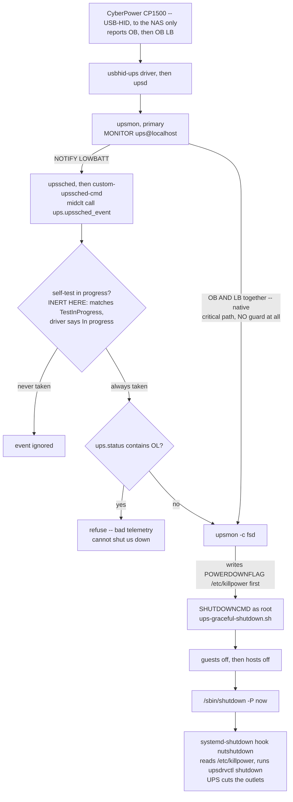
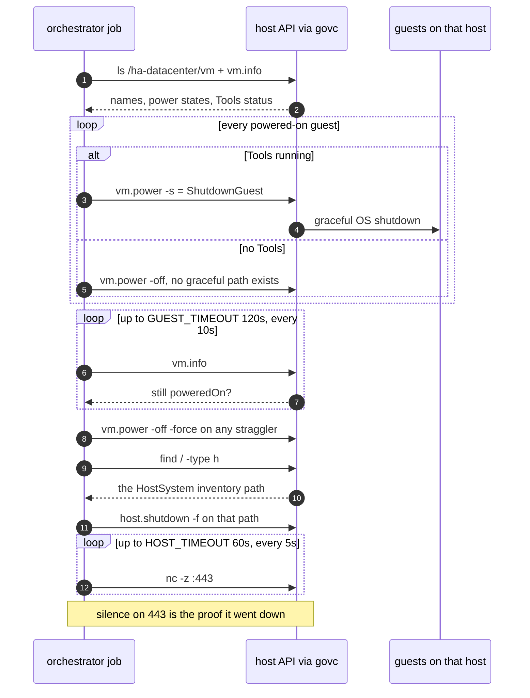
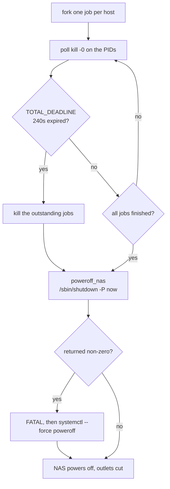
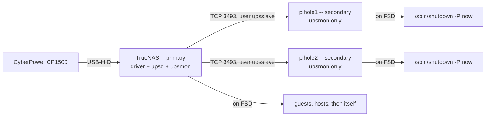

# UPS graceful shutdown

Status: **partially armed.** `shutdowncmd` now points at this script, so a real
low-battery event runs the graceful sequence instead of a bare poweroff. The
*trigger* is untouched (`shutdown=LOWBATT`, `shutdowntimer=30`) — moving it
earlier to `BATT` is a separate decision, see "Arming it" below.

Date: 2026-08-17

## The problem

One CyberPower CP1500PFCRM2U feeds the three ESXi hosts and the TrueNAS box. It
has no network management card, and its only signalling path is USB-HID to the
NAS, which runs NUT in master mode.

**17 of the 20 running guest VMs — including vCenter itself — live on TrueNAS storage**
(plus 2 vSphere-managed `vCLS` agents; verify with
`govc find / -type m -runtime.powerState poweredOn` and
`govc object.collect -s <vm> summary.config.vmPathName`):

| Datastore | Backing | VMs |
|---|---|---|
| `vmstore1` / `vmstore2` | TrueNAS iSCSI, zvols `pool_1/vmstorage/vmstore{1,2}` | 17 — everything except the control plane, incl. `vcenter`, `vcenter-Passive`, `vcenter-Witness` and workers 01–06 |
| `vm-lt-metrics` | TrueNAS NFS, `/mnt/pool_0/vm-lt-metrics` | second disk on `k8sworker01` |
| `esxi0N-local` | local NVMe | `k8scp01/02/03` only — one per host |

> The control plane sitting on **local** NVMe is the property this whole design leans on: losing
> TrueNAS does not take etcd with it. `hosts/vsphere/vms.json` (collected 2026-07-02) still shows
> the control plane on `vmstore1`/`vmstore2` — that snapshot predates the
> [etcd local-NVMe migration](https://github.com/vollminlab/k8s-vollminlab-cluster/blob/main/docs/runbooks/etcd-local-nvme-migration.md)
> and is stale. Live vCenter confirms `k8scp01 → esxi01-local`, `k8scp02 → esxi02-local`,
> `k8scp03 → esxi03-local`. The same snapshot omits `vm-lt-metrics`, which does exist (13.4 TB).

The stock UPS config is `shutdown=LOWBATT`, `shutdowntimer=30`, `powerdown=true`.
So on a long outage the NAS reaches low battery, shuts *itself* down first, and
then tells the UPS to cut the outlets feeding the still-running hosts. Storage
disappears from underneath the 17 shared-storage guests, and moments later they are hard-killed.

That is an all-paths-down event on mounted filesystems followed by a power cut —
a manufactured version of the ext4 damage that cost ~200 Audiobookshelf covers in
July, which Longhorn reported as `healthy` the entire time because every replica
held an identical copy of the corruption.

**True runtime is unmeasured.** The UPS's own at-rest estimate is ~1300 s (22 min)
at ~33 % load, but nothing has ever validated it — there is no recorded real
discharge in the journal, which begins 2026-08-08 02:11.

> **Do not read the netdata UPS graphs on their own.** For 2026-08-08 02:47–05:33
> they show a textbook discharge to 0 % — 73 %→49 % in 14 s, 20 %→0 % in 10 s. It
> is fake: a `nut_libusb_get_string: Pipe error` at 02:46:11 left the driver
> publishing garbage for ~2.7 h. The NAS never lost power (one continuous boot
> since 02:11) and there are zero upsmon on-battery events. Always corroborate a
> suspected power event against boot history and upsmon events.

> **The unit's identity is reported three different ways.** It reports itself as
> `CP1500PFCRM2U` (1500 VA / **1000 W**, per `ups.realpower.nominal`); the
> configured driver string says `CP1500EPFCLCD`; the service `description` says
> "3000VA". Believe the device.

Battery health was checked directly on 2026-08-17 with
`upscmd ... test.battery.start.quick` → **"Done and passed"**, holding 23.5 V under
the real ~330 W load and recovering to float immediately. The battery is fine.

## What was ruled out

- **ESXi VM Startup/Shutdown ordering** — unavailable. `dasConfig.enabled=true`;
  vSphere deactivates per-host autostart for hosts in an HA cluster by design.
- **NutClient-ESXi VIB** (rgc2000) — the author states plainly: *"You should not
  use it for ESXi nodes in an HA cluster, otherwise the virtual machines will be
  abruptly stopped."* It is also an unsigned community VIB.
- **NUT slaves on the guests** — native and elegant, and `hostsync` would make the
  master wait for them. But it covers only Linux guests: the vCenter and VCHA
  appliances cannot run it, and the ESXi hosts still need a separate poweroff
  step. It also means an agent on ~13 hosts, only 9 of which are in the Ansible
  inventory.

## The design

TrueNAS is the NUT master, holds the UPS, and must be the last thing to power
off — so it is the orchestrator. Its `shutdowncmd` field replaces NUT's default
`/sbin/shutdown -p now`, which makes it the correct hook.

Control flows to **each ESXi host's own API**, not to vCenter:

```
TrueNAS  (NUT master; UPS on battery)
  └─ shutdowncmd → ups-graceful-shutdown.sh
       ├─ esxi01 API ─ ShutdownGuest × its VMs ─ poll ─ force stragglers ─ poweroff host
       ├─ esxi02 API ─ ShutdownGuest × its VMs ─ poll ─ force stragglers ─ poweroff host
       └─ esxi03 API ─ ShutdownGuest × its VMs ─ poll ─ force stragglers ─ poweroff host
  └─ then, and only then, poweroff the NAS
```

The three hosts are driven in parallel. vCenter is deliberately absent from the
path for two reasons: it is itself a VM on the storage being torn down, and VCHA
is live (`vcenter` + `vcenter-Passive` + `vcenter-Witness`), so shutting the
active node mid-sequence would trigger a failover. Going host-direct means each
appliance is simply shut down by whichever host it happens to run on, and the
sequence still completes if vCenter is already dead.

Graceful guest shutdown is delivered by VMware Tools, and Tools coverage is
**22/22 powered-on VMs** — every guest, including the Photon-based vCenter and
VCHA appliances and the vCLS agents. No per-guest configuration is required.

Nothing drains Kubernetes. The whole cluster is going down, so cordoning or
draining would only migrate pods onto nodes that are about to die. A Tools
shutdown triggers a normal systemd shutdown inside each node, which stops kubelet
and unmounts volumes cleanly — which is the property that matters.

## How the trigger actually reaches the orchestrator

Two independent paths lead to `SHUTDOWNCMD`, and **only one of them is guarded**.
This is the single most surprising part of the setup, so it is worth a picture.



Three things this makes obvious that the prose does not:

- **The `OL` check is the only working guard.** The self-test check next to it
  compares against `TestInProgress`, while `usbhid-ups` reports `In progress`, so it
  never matches.
- **upsmon's native path bypasses the middleware entirely.** Nothing TrueNAS does
  can veto it. It requires `OB` *and* `LB` together — which the sandbox rig
  confirms empirically, and which is why a deep battery test's outcome hinges
  entirely on whether the driver reports `OB` while discharging.
- **Cutting the UPS outlets is downstream of the NAS actually entering shutdown.**
  That is why `shutdown -p` failing silently cost more than the NAS staying up: the
  `nutshutdown` hook never ran either.

## Files

Mastered here, deployed to the NAS:

| Repo path | Deployed to |
|---|---|
| `scripts/ups-shutdown/ups-graceful-shutdown.sh` | `/mnt/pool_0/scripts/ups-shutdown/` |
| `scripts/ups-shutdown/ups-shutdown.env.example` | → `ups-shutdown.env` (0600, **not** in git) |
| — | `govc` static binary, same directory |

`pool_0/scripts` is a dataset created for this, so it survives TrueNAS upgrades —
the root filesystem does not.

`ups-shutdown.env` holds an ESXi root credential in cleartext. That is
unavoidable: the script runs unattended from NUT during a power event, so it
cannot prompt and 1Password is unreachable by then. File permissions are the
control. The value comes from 1Password item **ESXi Root** (Homelab vault).
Hardening follow-up: replace root with a dedicated ESXi local user holding only
the shutdown privileges.

## What the orchestrator does

Three host jobs run in parallel; the main shell polls them and owns the deadline.



The main shell's own loop is deliberately not `wait`:



`wait` only reaps the calling shell's own children, so delegating it to a subshell
returned instantly and powered the NAS off five seconds in — the exact failure this
script exists to prevent. Polling `kill -0` in the main shell is the fix.

## The timing budget, and why it nests

Every timeout here is bounded by the one above it. The window opens when `LOWBATT`
fires, which is `battery.runtime.low` — 300 seconds of projected runtime.

```mermaid
gantt
    title Everything must finish inside the LOWBATT window
    dateFormat X
    axisFormat %S
    section UPS
    battery.runtime.low 300s           :0, 300
    section Orchestrator
    TOTAL_DEADLINE  240s               :0, 240
    GUEST_TIMEOUT  120s                :0, 120
    HOST_TIMEOUT 60s after guests      :120, 180
    section Node
    logind InhibitDelayMaxSec 70s      :0, 70
    kubelet grace - normal pods 40s    :0, 40
    kubelet grace - critical pods 20s  :40, 60
```



The node bars went live on 2026-09-20 (cluster repo issue #1269). Before that,
`shutdownGracePeriod` was `0s` on all nine nodes, so containers were killed abruptly
on every shutdown and `terminationGracePeriodSeconds` was never honoured.

**The kubelet period must fit inside `GUEST_TIMEOUT`**, or every node gets
force-powered-off mid-checkpoint, which is worse than not having it at all. 60s
against 120s leaves the guest-shutdown poll room to observe the node actually stop.

### The node bars have their own nesting, one level down

`shutdownGracePeriod` is the **total**, and `shutdownGracePeriodCriticalPods` is the
slice reserved at the end of it — not an addition. 60s/20s means ordinary pods get
40s, then critical pods get the last 20s. Raising the critical value shrinks the
normal one.

Above both sits a systemd ceiling that is easy to miss. kubelet holds a logind
inhibitor lock, and systemd honours it for at most `InhibitDelayMaxSec`. If that
value is below `shutdownGracePeriod`, pods get the **smaller** number while
`configz` still reports the larger one — configured, reported, and inert.

That ceiling is **not** in `/etc/systemd/logind.conf`, where the setting appears
commented out as `#InhibitDelayMaxSec=5`. Ubuntu ships a package drop-in that sets
it to 30s:

```
/usr/lib/systemd/logind.conf.d/unattended-upgrades-logind-maxdelay.conf
```

So ask systemd what is in effect rather than reading that one file:

```bash
systemd-analyze cat-config systemd/logind.conf | grep InhibitDelayMaxSec
busctl get-property org.freedesktop.login1 /org/freedesktop/login1 \
  org.freedesktop.login1.Manager InhibitDelayMaxUSec
```

**The override's filename decides whether it works at all.** systemd applies logind
drop-ins in filename sort order across every drop-in directory, last assignment
wins. The obvious name, `99-kubelet-graceful-shutdown.conf`, sorts *before*
`unattended-upgrades-logind-maxdelay.conf` and would be silently overridden back to
30s. Being in `/etc` does not save it — directory precedence only breaks ties
between files with the *same* name. The live file is therefore:

```
/etc/systemd/logind.conf.d/zz-kubelet-inhibit-delay.conf
  [Login]
  InhibitDelayMaxSec=70
```

and the rollout asserts the live D-Bus value is `70000000` before touching the
kubelet config, so a name that loses the sort fails loudly instead of quietly.

## Safety properties

- **The NAS always powers off.** Every exit path, including a missing config file
  or an unusable `govc`, ends in `poweroff_nas()`. A bug must never leave the NAS
  running until the battery dies — that ends in exactly the uncontrolled power
  loss this exists to prevent.
- **A hard deadline** (`TOTAL_DEADLINE`, 240 s) bounds the whole run. When it
  expires the NAS powers off regardless of what is still in flight. It is sized to
  fit inside the ~300 s the LOWBATT trigger leaves.
- **Per-host guest timeout** (`GUEST_TIMEOUT`, 120 s), after which stragglers are
  forced off so one stuck guest cannot block its host.
- **Host poweroff is confirmed**, not assumed — the script polls until the host
  stops answering on 443, so a silently-failed shutdown is visible in the log.
- **A guest without running Tools is powered off immediately** rather than waiting
  out the full timeout, since no graceful path exists for it.
- **The k8s nodes drain themselves inside their guest-shutdown window.** kubelet's
  Graceful Node Shutdown (60s, split 40s/20s) runs while the orchestrator is waiting
  out `GUEST_TIMEOUT`, so pods get their `terminationGracePeriodSeconds` instead of a
  SIGKILL. It is bounded by a 70s logind inhibitor ceiling — see the timing budget
  above for why that ceiling is not where you would expect to find it.

## Verification so far

Dry run on the NAS, 2026-08-17. It enumerated all three hosts and 22 powered-on
VMs, resolved each HostSystem inventory path, and printed the full plan without
touching anything:

```
[esxi01] 9 powered-on VMs (9 via Tools)
[esxi02] 8 powered-on VMs (8 via Tools)
[esxi03] 5 powered-on VMs (5 via Tools)
```

DRS is `fullyAutomated` and moves guests between hosts continuously — that split
was 10/7/5 an hour earlier. The script enumerates each host live at shutdown time,
so migration is handled; the residual edge case is a vMotion landing on a host
between its final force-off sweep and its poweroff.

The deadline path was exercised separately against a black-hole address
(`192.0.2.1`, TEST-NET-1) and fired correctly at 25 s, killing the outstanding
host job before powering off.

The dry run found two defects that would have been fatal in a real event:

1. **The completion wait returned instantly.** `wait` only accepts the calling
   shell's own children, so delegating it to a subshell made the script declare
   "all hosts finished" after 5 s and power the NAS off while every guest was
   still shutting down — reproducing the exact failure being fixed.
2. **Environment overrides were silently ignored.** Sourcing the env file
   overwrote them, so a test run with substituted hosts acted on the *real* hosts
   instead. Precedence is now environment > env file > defaults.

### The third defect, found 2026-09-16 — and why it took five weeks

`poweroff_nas()` ran `/sbin/shutdown -p now`. On TrueNAS SCALE `/sbin/shutdown` is
systemd's compatibility interface, which accepts `-P` but **not** lowercase `-p`:

```
$ /sbin/shutdown -p --show
/sbin/shutdown: invalid option -- 'p'      # exit 1
$ /sbin/shutdown -P --show
No scheduled shutdown.                     # parses fine
```

In a real event every guest and host would have shut down correctly, and then the
last step would have failed silently — the log line "powering off the NAS" written,
the command exiting 1, the script exiting 0. The NAS would have stayed up on
battery with the pools imported until the UPS died, taking the uncontrolled power
loss itself, and `/lib/systemd/system-shutdown/nutshutdown` would never have run to
cut the UPS outlets. `die_but_poweroff()` shares the function, so every fatal path
failed the same way.

**Why no amount of dry running could find it:** `poweroff_nas()` returns at its
`DRY_RUN` branch *before* reaching the command. The rehearsal exercised every line
except that one. `bash -n` cannot help either — the syntax is valid; only the flag
is wrong.

The lesson is general enough to be worth stating as a rule: **a rehearsal must
execute something for every line the real run executes.** That is what `VERIFY=1`
now does, and the flag itself is asserted by the test suite in CI.

The guest-shutdown path was then proven **live** on 2026-08-17: `govc vm.power -s`
against `devsbx01` on the real host API returned `OK` in 0.2 s, the guest shut down
cleanly via Tools, and came back healthy. That is the same call the orchestrator
issues for every VM.

**`host.shutdown` was proven live on 2026-09-16** and nothing in the path is
inferred any more. esxi03 was put in maintenance mode, and the orchestrator's exact
call was issued **as `ups-shutdown`, against the host's own API**:

```
govc host.shutdown -f /ha-datacenter/host/esxi03.vollminlab.com/esxi03...  OK  rc=0
 5s still answering on 443
host down after 10s
```

The `nc -z 443` confirmation loop behaved as designed. In the same window,
`vm.power -s k8scp03` as `ups-shutdown` powered that guest off in under 10 seconds,
so the least-privilege role's ShutdownGuest is verified in practice too.

**Getting a host into maintenance mode is not free, and the reason is worth
recording.** `EnterMaintenanceMode` stalled at 23 % with no error because
`k8scp03` sits on `esxi03-local`: DRS performs only *compute* vMotion, so a guest
on host-local storage can never be evacuated automatically. It was **not** the
anti-affinity rules — all four cluster rules carry no `mandatory` field, so DRS is
free to violate them. `vcenter-Passive` also had to be migrated by hand. The
recipe is: drain and power off the local-storage guest, hand-migrate any VCHA node
that will not move, and remember that a powered-off guest can stay *registered*
without blocking anything.

When restoring afterwards, **exit maintenance mode before powering the CP back
on** — HA admission control reserves 33 %, and with one host out the cluster sits
close enough to its limit to refuse the power-on.

**What is still unmeasured:** how long a real graceful shutdown takes, and the true
battery runtime. Both come from one planned power-down whenever that is
acceptable.

## Testing it

Three layers, cheapest first.

**1. The test suite — no cluster, no UPS, runs in CI.**

```bash
bash scripts/ups-shutdown/ups-graceful-shutdown_test.sh
```

Pure-shell stubs for `govc`, `nc` and the poweroff command. It asserts the
poweroff flag parses, that `VERIFY` never invokes a destructive verb, that a
failed poweroff is never silent, and that environment beats the env file. The
poweroff assertions fail if the `-p` defect is reintroduced — verified by
mutation.

**2. `VERIFY=1` on the NAS — probes every real action without performing one.**

```bash
cd /mnt/pool_0/scripts/ups-shutdown && VERIFY=1 ./ups-graceful-shutdown.sh; echo "exit=$?"
```

| Real action | What VERIFY executes instead |
|---|---|
| `shutdown -P now` | the same binary and flags with `--show` — parses, no action |
| `vm.power -s <vm>` | `govc vm.info <vm>` — the name the real call uses still resolves |
| `host.shutdown -f <path>` | resolve the HostSystem path, then read the principal's granted role |
| `nc -z <host> 443` | run as-is — proves the host-down poll works while the host is up |

Exit status is the verdict: 0 means every probe passed, non-zero lists the
failures. Safe to run any time, and the thing to run after any credential
rotation, TrueNAS upgrade or script edit.

**3. Dry run — enumerates and prints the plan.**

```bash
DRY_RUN=1 ./ups-graceful-shutdown.sh

# Exercise the deadline without touching real hosts
DRY_RUN=1 ESXI_HOSTS="blackhole=192.0.2.1" TOTAL_DEADLINE=25 ./ups-graceful-shutdown.sh
```

Logs land in `/mnt/pool_0/scripts/ups-shutdown/logs/ups-shutdown.log`. A non-root
run cannot write that file (it is root-owned) and now says so once instead of
emitting a "Permission denied" line per log call.

**Deploying a change is a separate step.** The script lives in git and runs from
`/mnt/pool_0/scripts/ups-shutdown/` on the NAS; merging does not update the NAS.
After any merge, copy it over and confirm:

```bash
sha256sum /mnt/pool_0/scripts/ups-shutdown/ups-graceful-shutdown.sh   # must match git
```

## Knowing it is happening: the event watcher

Everything else here is about what happens *during* an outage. None of it says one is
happening. TrueNAS's own notification path —
`NOTIFYFLAG ONBATT/LOWBATT` → `upssched` → `midclt ups.upssched_event` → a middleware
alert — terminates in an **unconfigured mail server** (`outgoingserver: ''`,
`from: root@truenas.local`), so before 2026-09-16 a power event was entirely silent
until things began shutting down.

`scripts/ups-shutdown/ups-watch.sh` runs every minute from a TrueNAS cron job and
pushes to Pushover **on a state change only**:

| Transition | Priority | Why |
| --- | --- | --- |
| → on battery | 1 (high) | includes charge and remaining runtime |
| → low battery | **2 (emergency)** | the orchestration is starting; this is the last warning |
| → FSD | **2 (emergency)** | guests, hosts and the NAS are going down now |
| → power restored | 0 (normal) | names the state it came from |
| driver silent 3 minutes | 1 (high) | the shutdown path cannot trigger on a state nobody can read |

Details that are load-bearing rather than decorative:

- **Pushover priority 2 requires `retry` and `expire`.** Without them the API rejects
  the message, which would lose precisely the two alerts that matter most.
- **`OL LB` is not treated as a low battery.** It is the bad-telemetry case TrueNAS's
  own guard exists for, and a UPS reporting both should not page anyone.
- **A single unreadable poll is ignored.** `usbhid-ups` logs benign libusb pipe errors
  dozens of times a day and keeps working; only three consecutive minutes of silence
  is worth waking someone for, and it alerts once rather than every minute.
- **Recovering from a driver outage does not fake a power event.** The previous state
  is held across the silence, so readings resuming on mains is not reported as
  "power restored".
- Deliberately **independent of the cluster**, like the preflight: a UPS problem has to
  be reportable when the thing hosting Alertmanager is what is at risk.

Verified end to end on 2026-09-16 by stubbing `upsc` to report `OB DISCHRG` — the real
UPS untouched — which produced a real "Lab is on battery" notification, stayed silent
on the following poll, and sent "Lab power restored" when pointed back at the real
device.

```bash
# What would it do right now, without notifying anyone?
DRY_RUN=1 ./ups-watch.sh
```

**Why the network gear is deliberately not orchestrated.** The UDM and switches are on
the UPS and are left alone on purpose — they are not an oversight. They must stay up
*through* the shutdown: the orchestrator reaches the ESXi hosts over the network, and
the Pi-holes learn the UPS state over it as NUT secondaries. Shutting the network down
early would break the very sequence it is carrying. There is also no good place to do
it: they would have to go last, after the NAS, and once the NAS is off nothing is left
to issue the command. The UPS cutting its outlets *is* the correct final step for them,
and their state is flash written rarely rather than continuously. The one device worth
revisiting is a UDM with an attached disk for Protect recordings, which does write
continuously.

## Keeping it true: the scheduled preflight

Verification that only happens when someone remembers to run it decays into no
verification. `scripts/ups-shutdown/ups-preflight.sh` runs weekly from a TrueNAS
cron job as root and answers one question — *if the power failed right now, would
the orchestration run?*

| # | Check | The failure it catches |
|---|---|---|
| 1 | orchestrator present and executable | a dataset rollback, a botched deploy |
| 2 | sha256 matches the pinned value | a hand-edit to the deployed copy |
| 3 | `govc` present and executable | the binary lost or replaced |
| 4 | env file exists, mode 600 | a credential file made world-readable |
| 5 | `upsc` returns a status | the NUT driver stopped reporting |
| 6 | `ups.config` shutdowncmd / mode / powerdown | a TrueNAS upgrade or UI save regenerating `/etc/nut` |
| 7 | `upsmon.conf` has MONITOR + the right SHUTDOWNCMD | upsmon running but watching nothing |
| 8 | `VERIFY=1` exits 0 | rotated ESXi password, unreachable host, lost privilege, bad poweroff flag |

Checks 6 and 7 need root; a non-root run reports them as SKIP rather than passing
them vacuously, and the summary line always states how many were skipped.

**Failure alerts go straight to Pushover, not through Alertmanager.** A UPS
problem has to be reportable when the cluster hosting Alertmanager is exactly
what is at risk. Credentials live in `pushover.env` (0600, gitignored, values
from the 1Password item *Pushover API Token*); success is silent and writes
`logs/last-preflight-ok`.

**The schedule is a TrueNAS middleware cron job** (id 5, `Mondays 09:17`, user
root), not a raw crontab entry — middleware jobs survive upgrades and are visible
in the UI under System → Advanced → Cron Jobs.

```bash
# Recreate it if it is ever lost
midclt call cronjob.create '{"user":"root",
  "command":"/mnt/pool_0/scripts/ups-shutdown/ups-preflight.sh",
  "description":"UPS shutdown path preflight (alerts via Pushover on failure)",
  "schedule":{"minute":"17","hour":"9","dom":"*","month":"*","dow":"1"},
  "enabled":true,"stdout":true,"stderr":false}'
```

```bash
# On demand, without sending anything
ALERT=0 ./ups-preflight.sh; echo "exit=$?"

# When did it last pass?
cat /mnt/pool_0/scripts/ups-shutdown/logs/last-preflight-ok
```

## Deploying a change to the NAS

Merging does not update the NAS. After any merge that touches the orchestrator:

```bash
scp scripts/ups-shutdown/ups-graceful-shutdown.sh vollmin@192.168.150.2:/mnt/pool_0/scripts/ups-shutdown/
ssh vollmin@192.168.150.2 'cd /mnt/pool_0/scripts/ups-shutdown &&
  sha256sum ups-graceful-shutdown.sh | tee ups-graceful-shutdown.sh.sha256 &&
  VERIFY=1 ./ups-graceful-shutdown.sh; echo "exit=$?"'
```

Re-pinning the sha is part of deploying, not an afterthought — check 2 fails
until it is done, which is the intended prompt.
## The sandbox rig — testing the link nothing else touches

`VERIFY=1` proves the orchestrator would do the right thing *if it were called*.
The preflight proves the configuration still points at it. Neither exercises the
link between them: **upsmon's own decision that the UPS is critical, and the
hand-off from that decision to `SHUTDOWNCMD`.** That link is upstream C plus a
generated config, it runs exactly once in the life of a power event, and until
2026-09-16 it had never run here at all.

`scripts/ups-shutdown/test-rig/run-sandbox-test.sh` replays a simulated outage
through a real NUT stack:

```bash
sudo ./scripts/ups-shutdown/test-rig/run-sandbox-test.sh
```

A `dummy-ups` driver walks `OL` → `OL LB` → `OB` → `OB LB`; a private `upsmon`
watches it and calls the **real orchestrator** as its `SHUTDOWNCMD`, against a
stub `govc`, TEST-NET hosts and a stub poweroff command. What it asserts:

| Assertion | Why it matters |
|---|---|
| upsmon reached FSD and invoked SHUTDOWNCMD | the never-tested link |
| invoked as root | a non-root invocation could not power the NAS off |
| POWERDOWNFLAG written *before* SHUTDOWNCMD | confirms the UPS outlets will be cut |
| **no trigger while the UPS was `OL`** | `LB` alone must never act — this is the bad-telemetry case |
| orchestrator completed under upsmon's environment | `PATH` is `/usr/local/bin:/usr/bin:/bin:/usr/games` — **no `/sbin`** |
| orchestrator reached and ran the poweroff command | dry runs return before this line; here it actually executes |

It runs deliberately **not** on the NAS: `NUT_CONFPATH` and a short private
`NUT_STATEPATH`, port 3494, and the binaries invoked at `/lib/nut/*` to bypass
the Debian `/sbin` wrappers that refuse to start unless `MODE` is set in the
*system* `nut.conf`. Nothing real is contacted and nothing is powered off.

Not wired into CI: it needs root and the NUT packages
(`apt install nut-server nut-client`). Run it on devsbx01 after any change to the
orchestrator's invocation contract. Mutation-checked — pointing `ORCHESTRATOR` at
a script that exits non-zero turns three assertions red.

**The `OL LB` step is the empirical version of a claim worth keeping:** upsmon
declares a UPS critical only when `OB` *and* `LB` are set together. The rig sits
through five seconds of `OL LB` without acting, then fires 14s in when `OB LB`
arrives. That is the mechanism behind "never run a deep battery test while the
lab is up" — whether a deep test trips this depends entirely on whether the
driver reports `OB` while discharging.

## The credential: a least-privilege account, not root

The orchestrator authenticates as **`ups-shutdown`**, a local account on each host
holding a **custom `ups-shutdown` role** — not Admin:

```
Host.Config.Maintenance            # required by ShutdownHost_Task
VirtualMachine.Interact.PowerOff   # ShutdownGuest and the forced power-off
System.View / System.Read / System.Anonymous
```

Custom roles **are** supported on a standalone ESXi host, contrary to a common
belief that they are a vCenter-only feature. `govc role.ls` showing only the eight
built-ins means none has been created, not that none can be. Note that
`esxcli system permission set` accepts only Admin/ReadOnly/NoAccess, so the
assignment must go through the API, Host Client or PowerCLI.

```bash
# What was done on each host, reproducibly
govc role.create ups-shutdown System.Anonymous System.Read System.View \
                              VirtualMachine.Interact.PowerOff Host.Config.Maintenance
govc host.account.create -id ups-shutdown -password "$PW" \
                         -description "UPS graceful shutdown orchestrator (TrueNAS)"
govc permissions.set -principal ups-shutdown -role ups-shutdown -propagate=true /
```

**Why this was worth doing, given the role still can power off any guest:** it is
not really about privilege reduction. It is that the previous credential was ESXi
root, which the vault records as *also* vCenter root — so a cleartext file on the
NAS held the keys to all three hypervisors and vCenter. It also decouples rotation
(rotating admin credentials no longer silently breaks the shutdown path), contains
the measured lockout policy (`Security.AccountLockFailures=5`,
`Security.AccountUnlockTime=900`) to one principal, and makes the audit trail
unambiguous — `root` powering off a host is indistinguishable from an admin doing
it deliberately.

Password lives in the 1Password item **ESXi UPS Shutdown**. Rotating it means
editing the vault item, `govc host.account.update -id ups-shutdown -password …` on
all three hosts, updating `ups-shutdown.env`, and re-running `VERIFY=1`.

**The privilege probe asks what the role _contains_, not what it is called.**
Asserting `role == Admin` was wrong in both directions: it fails a correct
least-privilege role, and it would pass an "Admin" role someone had edited to
remove a privilege. Override the expected set with `REQUIRED_PRIVILEGES` if the
orchestrator ever needs more.

## Proving `host.shutdown`: the maintenance-mode rehearsal

`host.shutdown` is the one step `VERIFY` cannot exercise, because there is no way
to test it but to do it. Maintenance mode makes that safe: DRS evacuates every
guest first, so the call lands on an empty host.

**Measured 2026-09-16 — the cluster can absorb it.** Guest RAM totals 177.4 GB
against 191.4 GB on any two hosts (93 % committed while one host is out, ~7-8 GB
margin on consumed memory). All four DRS rules are **soft**, so anti-affinity will
not block the evacuation. HA admission control (33 % CPU / 33 % memory) means you
**cannot power on new VMs** while a host is out; running guests and vMotion are
unaffected. Stay out of the 03:00-06:00 UTC backup window.

**Evacuate `esxi03`** — fewest guests (5), least RAM to move (53.2 GB), and it
holds neither `devsbx01` nor the active vCenter.

```bash
# 1. Evacuate. DRS is fullyAutomated, so this moves the guests for you.
govc host.maintenance.enter -host esxi03.vollminlab.com
govc object.collect -s HostSystem:host-XXX runtime.inMaintenanceMode   # wait for true

# 2. The exact call the orchestrator makes — no substitutions.
govc host.shutdown -f /ha-datacenter/host/esxi03.vollminlab.com/esxi03.vollminlab.com

# 3. Confirm it actually went down, the way the orchestrator does.
nc -z 192.168.151.4 443 || echo "host is down"

# 4. Power back on, then exit maintenance mode.
govc host.maintenance.exit -host esxi03.vollminlab.com
```

Step 2 must be issued **against the host's own API** (`GOVC_URL=https://192.168.151.4/sdk`)
as `ups-shutdown`, not through vCenter as an admin — otherwise it proves a
different code path from the one that runs during an outage.

**Before starting, confirm the power-on path.** These are MS-01s with no BMC. If
Intel AMT is provisioned and in admin control mode, MeshCommander can power the
host back on remotely; otherwise step 4 needs physical access to the power button.

## The Pi-holes shut themselves down: NUT secondaries

`pihole1` and `pihole2` are on the UPS but have **no USB connection to it** — so
before 2026-09-16 nothing told them a power event was happening and they were
hard-cut when the outlets were killed.

That is what NUT's client/server split is for. The cable is only needed on one
machine: the NAS runs the driver plus `upsd` plus `upsmon` in **primary** mode, and
any other host runs `upsmon` in **secondary** mode, which opens a TCP connection to
the primary's `upsd` on 3493 and is told the UPS state. No hardware on the client.



When the primary declares FSD, each secondary runs its own local shutdown, in
parallel with the guest/host orchestration. **`HOSTSYNC 15` was already configured on
the primary** and until now did nothing — it is precisely "wait up to 15s for
secondaries to finish and disconnect before I proceed".

Configuration, for the record:

- **NAS**: `rmonitor: True` on the UPS service, which is what makes `upsd` listen off
  the box (it was `LISTEN ::1 3493` — IPv6 localhost only — so no client could have
  connected regardless). A dedicated `upsslave` account was added via `extrausers`
  so it survives config regeneration; credential in 1Password **TrueNAS NUT Secondary**.
- **Each Pi**: `nut-client`, `MODE=netclient`, and
  `MONITOR ups@192.168.150.2 1 upsslave <password> secondary` with
  `SHUTDOWNCMD "/sbin/shutdown -P now"`.

**Note the `-P`.** Raspberry Pi OS is Debian 12, so `/sbin/shutdown` is systemd's
compat interface and rejects lowercase `-p` exactly as the NAS did — verified on both
Pis before writing the config. The same one-character bug was available to make here.

`collect-host-configs.sh` now snapshots `/etc/nut/upsmon.conf` and `nut.conf`, with
the MONITOR line's password redacted. It is a *positional* field, so the existing
`redact_kv` helper cannot reach it and a dedicated `sed` handles it, on the host,
before the file is transmitted.

**The preflight counts the secondaries** (`EXPECT_SECONDARIES`, default 2). A Pi whose
`upsmon` quietly stops connecting is back to being hard-cut, and nothing else would
say so.

### What is not tested

That each Pi actually shuts down on FSD. Proving it means triggering a real shutdown
of a DNS server, which was explicitly out of scope. What *is* verified: the secondary
authenticates and reads live UPS state (`upsc ups@192.168.150.2` returns `OL`), the
NAS logs `User upsslave@<ip> logged into UPS [ups]`, `nut-monitor` is enabled at boot
on both, and the `SHUTDOWNCMD` flag parses on each host. The remaining gap is the same
shape as the one the shutdown orchestrator had before the maintenance-mode rehearsal,
and the next planned Pi reboot closes it.

DNS was verified answering on `192.168.100.2`, `.3` and the `.4` VIP before, during
and after; pihole1 kept the VIP throughout.

## Arming

| Field | State | Why |
|---|---|---|
| `shutdowncmd` | **SET** → `/mnt/pool_0/scripts/ups-shutdown/ups-graceful-shutdown.sh` | replaces the default bare poweroff |
| `shutdown` | unchanged, `LOWBATT` | moving to `BATT` fires earlier, with battery to spare |
| `shutdowntimer` | unchanged, `30` | only meaningful once `shutdown=BATT` |

**Verified live on 2026-08-17** via `GET /api/v2.0/ups` on TrueNAS — the repo's
`hosts/truenas/services.json` (2026-04-12) still records the UPS service as
`enable: false, STOPPED` and is simply stale:

| Field | Live value |
|---|---|
| service | `enable: true`, `state: RUNNING` |
| `mode` | `MASTER` |
| `driver` | `usbhid-ups$CP1500EPFCLCD` |
| `shutdown` | `LOWBATT` |
| `shutdowntimer` | `30` |
| `shutdowncmd` | `/mnt/pool_0/scripts/ups-shutdown/ups-graceful-shutdown.sh` (exists, 11 KB, mode 0755) |
| `hostsync` | `15` |

`collect-truenas-configs.sh` never fetches `/api/v2.0/ups`, which is why none of this is
captured in `hosts/` — worth adding to the collector.

The unit is a **CyberPower CP1500PFCRM2U** — PFC Sinewave, 1500 VA / 1000 W, 8 outlets, AVR,
short-depth 2U rackmount. NUT confirms this from the device itself:

```
$ upsc ups@localhost
device.model: CP1500PFCRM2U        ups.realpower.nominal: 1000
device.mfr:   CPS                  ups.load: 32
ups.status:   OL                   battery.charge: 100
battery.runtime: 1300              battery.runtime.low: 300
driver.version.data: CyberPower HID 0.6
```

> **The TrueNAS driver dropdown reads `usbhid-ups$CP1500EPFCLCD`, which is a different model — and
> that is fine.** `usbhid-ups` identifies the device over HID at runtime; the dropdown entry only
> seeds VID/PID matching. The proof is above: it reports the correct model and a correct 1000 W
> nominal. There is no `CP1500PFCRM2U` entry in NUT's driver list, so this is the closest
> selectable option and nothing needs changing.
>
> The one thing that *is* wrong is cosmetic: the TrueNAS `description` field says
> "CyberPower 3000VA". It is free text and affects nothing, but it should read 1500 VA / 1000 W.

**Runtime budget, measured 2026-08-17:** 1300 s of runtime at 32 % load, with
`battery.runtime.low` at 300 s. So LOWBATT fires with roughly **5 minutes** of battery left —
which is the real deadline the shutdown sequence below has to fit inside, and it is why
`TOTAL_DEADLINE` is 240 s rather than something more generous.

**Setting `shutdowncmd` alone is strictly safer than the stock config and adds no
new trigger risk.** It changes *what runs*, not *when*. Same LOWBATT trigger, but
the action becomes guests-first / NAS-last instead of the bare `/sbin/shutdown -P
now` that yanks iSCSI out from under the 17 shared-storage guests. Verified after setting it:

```
$ grep SHUTDOWNCMD /etc/nut/upsmon.conf
SHUTDOWNCMD "/mnt/pool_0/scripts/ups-shutdown/ups-graceful-shutdown.sh"
$ grep 'AT LOWBATT' /etc/nut/upssched.conf
AT LOWBATT  * EXECUTE SHUTDOWN          # trigger unchanged
```

Because it fires at LOWBATT, the sequence only has `battery.runtime.low` (300 s)
of projected runtime — which is why `TOTAL_DEADLINE` is 240 s, not 600. Moving to
`shutdown=BATT` with a timer would widen that window considerably, and is the
natural next step once a measured runtime figure exists.

### The trigger cannot fire on bad telemetry

TrueNAS's middleware guards the shutdown path itself (`ups.upssched_event`):

```python
if RE_TEST_IN_PROGRESS.search(stats_output): return    # self-test → ignore
if ups_status and 'ol' in ups_status[0].lower():
    # "Shutdown not initiated ... indicates ONLINE (OL)"
else:
    await run('upsmon', '-c', 'fsd', check=False)      # → runs SHUTDOWNCMD
```

It refuses to shut down whenever the UPS reports `OL`, explicitly because
"battery/charger issues can result in ups.status being 'OL LB' at the same time".
That is the same class of bad data that produced the fake 2026-08-08 discharge in
the netdata graphs, and it cannot reach the shutdown path.

`powerdown=true` stays as it is — cutting the outlets after the NAS is down is
correct once the hosts are already off.

Before arming, be aware the trigger becomes a *duration on battery*, so any
outage longer than `shutdowntimer` powers the lab down. That is the intent, but
it does make brief flickers consequential if the timer is set too low.

## Access notes

- TrueNAS SSH works as **`vollmin@192.168.150.2`** with the `truenas_id_rsa` key
  from 1Password. Earlier attempts failed only because they used `root` /
  `truenas_admin`; root has no authorized key and is refused for password auth.
  `192.168.100.5` is the IPMI/BMC, not the NAS, and `192.168.152.2` is NPM.
- `sudo` for `vollmin` requires the password (1Password item **TrueNAS**).
- The UPS state is readable without SSH via the API — `POST /api/v2.0/reporting/netdata_get_data`
  with graphs `upsruntime`, `upsload`, `upscharge`. The wrapper key is `query`;
  `reporting_query` returns HTTP 400.
- `GET /api/v2.0/ups` returns `monpwd` in cleartext — never redirect it to a file.
