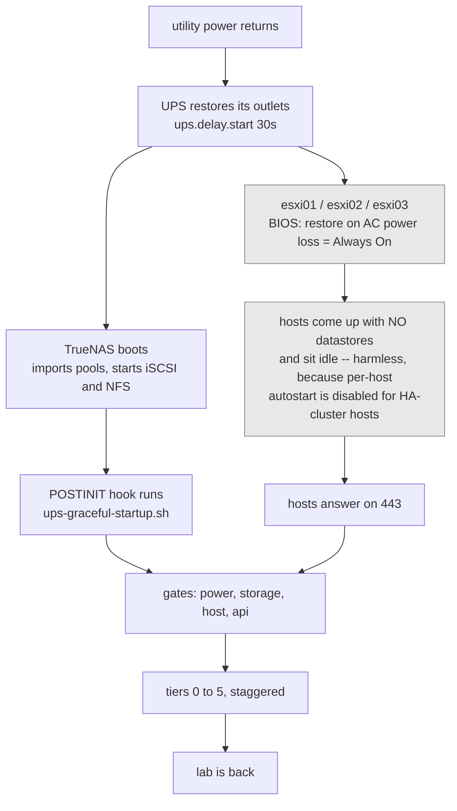
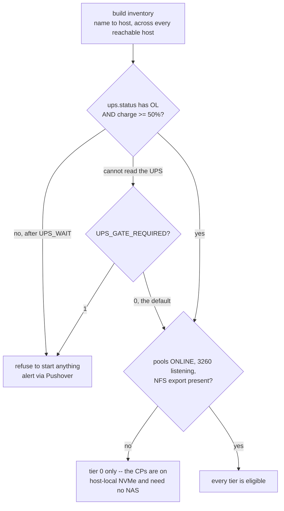
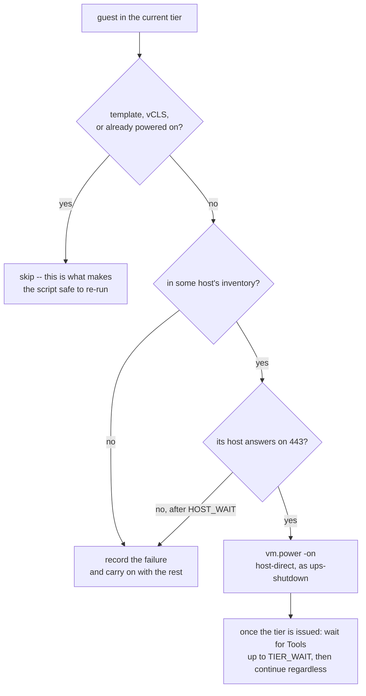

# UPS startup orchestration — plan

**Status:** implemented (#34), **not yet armed** — see *Arming* below
**Counterpart:** [ups-graceful-shutdown.md](ups-graceful-shutdown.md), which is complete and verified

The shutdown path brings 22 guests, 3 hosts and the NAS down cleanly when the
battery runs out. Nothing brings them back. Today recovery is entirely manual:
power each host by hand, then power on guests in whatever order occurs to you.

## The one design decision that matters

**Hosts power themselves on from firmware; the NAS owns only the guests.**

The instinct is to have the NAS wake the hosts once storage is ready, so nothing
ever boots into a world without datastores. That is the wrong trade, because it
makes host power-on depend on a chain of things that can each fail silently —
switches up, AMT provisioned and its credential valid, NAS booted, script correct
— and the failure mode when any link breaks is **hosts stay off**: a total outage
needing hands. BIOS AC-recovery depends on nothing, and its failure mode is a host
sitting idle with no datastores, which costs nothing because per-host autostart is
disabled by vSphere for HA-cluster hosts and HA does not restart guests that were
cleanly powered off.

| Layer | Owner | Why |
| --- | --- | --- |
| Host power-on | **BIOS "restore on AC power loss"** | zero dependencies; benign failure mode |
| Guest power-on, ordering, gating | **NAS startup orchestrator** | only the NAS knows when storage is actually serving |
| A host that did not come back | **Intel AMT**, manual or as a fallback | out-of-band, no BMC on the MS-01s |

Rejected, with reasons, so they are not re-proposed:

- **AMT-driven host power-on as the primary path** — see above. Viable as a
  *fallback* after a timeout, at the cost of putting AMT credentials on the NAS.
- **ESXi per-host autostart** — vSphere disables it for hosts in an HA cluster.
- **Doing nothing and recovering by hand** — the status quo; acceptable only
  because outages have been rare, and it scales badly at 2am.

## The recovery, end to end

Who does what — and in particular, what this script does **not** do.



**Nothing in the grey path is orchestrated.** Host power-on is firmware, and that is
the deliberate choice: it depends on no network, no NAS, no AMT and no credential,
and when it fails the result is a host idling without storage rather than a host
that never comes back. If the NAS woke the hosts instead, every one of those
dependencies would sit between a power cut and your cluster existing again.

## How it decides: gates, then guests

First, which tiers are eligible at all:



A broken NUT driver must never be able to prevent recovery, which is why an
unreadable UPS proceeds by default. Set `UPS_GATE_REQUIRED=1` to invert that.

Then, for each guest in each tier, in order:



Tier 3 additionally waits for the k8s API VIP on 6443 before it starts any worker —
a wait rather than a hard gate, because starting workers without an API endpoint is
harmless and they will retry.

Two properties worth reading off these: a guest that appears in **no** tier is never
started, only reported, so nothing gets woken by accident; and a host that never
returns costs you its own guests, not the whole recovery.

## What the inventory forces

Measured 2026-09-16.

- **All three control planes are on host-local NVMe** (`esxi0N-local`). Each can
  only ever run on its own host — but equally, each can start **without the NAS**.
  etcd quorum can therefore form before storage is serving.
- Everything else lives on `vmstore1`/`vmstore2` (TrueNAS iSCSI); `k8sworker01`
  also touches `vm-lt-metrics` (NFS).
- **Pi-hole is not a VM here**, so DNS does not depend on this sequence at all.
- `vCLS-*` are vCenter-managed and must **not** be powered on by hand.
  `ubuntu-template` is a template and is never powered on.

### Proposed tiers

| Tier | Guests | Gate before starting |
| --- | --- | --- |
| 0 | `k8scp01/02/03` | their own host is up — **no storage dependency** |
| 1 | `vcenter` | storage serving |
| 2 | `haproxy01/02`, `nginx01` | tier 1 settled (k8s API VIP + reverse proxy) |
| 3 | `k8sworker01`-`04` | tier 2 settled |
| 4 | `k8sworker05/06` (DMZ) | tier 3 settled |
| 5 | `ansible01`, `groupme01`, `devsbx01`, `haproxydmz01/02`, `vcenter-Passive`, `vcenter-Witness` | tier 4 settled |

Tiers are **staggered deliberately**. Powering 22 guests onto two shared VMDK
datastores at once is precisely the I/O storm that drove PSI full-stall to 26-48 %
during backups and took three nodes `NotReady` on 2026-08-25. Wait for VMware Tools
to report in on a tier before starting the next, with a per-tier timeout so one
stuck guest cannot stall the sequence.

## Gates — the parts that prevent this from making things worse

1. **Storage is genuinely serving**: pools `ONLINE`, 3260 listening locally, the
   NFS export present. Not "the NAS booted".
2. **Power is genuinely back**: `ups.status` is `OL` **and** `battery.charge` is
   above a threshold (proposed 50 %). Without this, a flapping utility gives a
   boot/shutdown loop — the mirror image of the problem the shutdown path solves,
   and worse, because each cycle is a hard stop for anything mid-boot.
3. **The host answers on 443** before any guest is aimed at it, with a timeout.
4. **Idempotent throughout**: skip guests already powered on, single lockfile,
   safe to re-run by hand at any point. It must be usable as a recovery tool, not
   only as an automation.

## What to gate on — and what not to

A real observation from the 2026-09-16 rehearsal, worth designing against.
When `k8scp03` rebooted, `metallb-speaker` crash-looped with:

```
dial tcp 10.96.0.1:443: i/o timeout
```

It had started before kube-proxy and Calico finished programming the service
network. It recovered on its own within a minute. The tempting conclusion is that
the orchestrator should wait for Kubernetes to be *ready* before proceeding.

**It should not, and could not.** That race is **intra-node**: kubelet starts every
DaemonSet pod on a node at roughly the same moment, and metallb-speaker lost a
footrace against two peers started by the same kubelet on the same machine. No
ordering of *virtual machines* can affect it. CrashLoopBackOff is the mechanism
working — retry with backoff until the dependency exists.

Gating on Kubernetes object state would also invert the dependency graph. The NAS
would need a kubeconfig, a token and a route to the API — and the API VIP is
`haproxy01/02`, **virtual machines this orchestrator is responsible for starting**.
It would be waiting on something it has not started yet. Worse, it couples the
power layer to the application layer, so a Kubernetes problem stalls VM power-on,
turning a self-healing annoyance into a stuck recovery. That is the same trade
rejected for AMT-driven host power-on, for the same reason.

**The rule: gate on reachability of what the next tier needs, never on the health
of what the last tier runs.** Every gate must be answerable with no credentials and
no cluster knowledge.

| Before | Wait for | Mechanism |
| --- | --- | --- |
| any tier | previous tier's guests actually booted | VMware Tools heartbeat via `govc` |
| tier 3 (workers) | the k8s API answering | `nc -z 192.168.152.7 6443` (HAProxy VIP) |
| tier 1 | storage serving | pools ONLINE, 3260 listening, NFS exported |

If application-level ordering is ever genuinely needed, its home is **in-cluster** —
startup probes, init containers, or a post-boot Job. Kubernetes has those
primitives; the NAS does not and should not.

## Two privileges the `ups-shutdown` role does not have

The role was built for shutting down. Starting up needs:

- **`VirtualMachine.Interact.PowerOn`** — mandatory; the role holds only `PowerOff`.
- **`Host.Config.Storage`** — only if the orchestrator forces
  `govc host.storage.rescan` so datastores appear promptly rather than waiting for
  ESXi's own retry. Worth deciding: the rescan removes a several-minute wait, at
  the cost of one more privilege.

Either extend the existing role or create a second `ups-startup` role. **Extending
is simpler and the blast radius is identical** — anything that can power a guest
off can power it on.

## The dirty-outage case, which is the interesting one

Everything above describes recovery from a *clean* orchestrated shutdown. After a
**dirty** outage — orchestration failed, or the UPS died first — hosts boot with
AC-recovery and **HA restarts every guest that was running at the moment of host
failure**, unordered, all at once, possibly before the NAS is serving.

That is self-healing but stormy, and it bypasses the tiering entirely.

**Proposal: set vSphere HA restart priorities to mirror the tiers.** HA supports
five priority levels plus "start next priority when: resources allocated / powered
on / guest heartbeat detected". Configuring them costs nothing, changes nothing in
the clean path, and gives the dirty path the same ordering for free. This is the
cheapest robustness win available here and it should probably land before the
orchestrator itself.

Note the three CPs already have `restartPriority: disabled`, correctly — their
storage is local, so HA could never restart them elsewhere.

## Testing, mirroring what the shutdown path now has

1. **`VERIFY=1`** — probe every action without performing it: hosts reachable,
   credential valid, `PowerOn` privilege held, each guest resolvable, gates
   evaluable. Exit status is the verdict.
2. **Stubbed test suite in CI** — gate logic, tier ordering, idempotency,
   timeout handling. No cluster required.
3. **A real rehearsal is cheap here, unlike shutdown**: power off one expendable
   guest and let the orchestrator bring it back. There is no equivalent of
   "you must down a host to test it".
4. **Extend `ups-preflight.sh`** to cover the startup path's own drift.

## Open questions for review

1. **Threshold for gate 2** — 50 % charge, or time-based (`battery.runtime` above
   the full sequence's worst case)?
2. **AMT fallback** — power a host on after N minutes, or page instead? It means
   AMT credentials on the NAS.
3. **`host.storage.rescan`** — worth the extra privilege to skip the wait?
4. **HA restart priorities** — land these first, independently of the orchestrator?
5. **Does `devsbx01` belong in tier 5?** It is where Claude sessions run, so
   bringing it up earlier may be convenient during a recovery.

*(A sixth — whether to gate on DaemonSet/pod readiness — is answered above: no.
Recorded rather than dropped, so it is not re-proposed.)*

## Implementation status

| Item | State |
| --- | --- |
| Role extended with `VirtualMachine.Interact.PowerOn` | **done**, all three hosts |
| `ups-graceful-startup.sh` + `VERIFY=1` | **done**, deployed to the NAS |
| Stubbed test suite (45 assertions) | **done**, wired into CI |
| Live rehearsal of the power-on path | **done** — see below |
| `RESCAN_STORAGE` (needs `Host.Config.Storage`) | implemented, **default off** — your call |
| AMT out-of-band power-on fallback | **implemented and credentials deployed**; validated read-only from the NAS. See below |
| HA restart priorities mirroring the tiers | **dropped** — see *Why HA priorities were dropped* |
| Preflight covers the startup path too | **done** — 14 checks, incl. the startup sha and its VERIFY |
| Arming it (boot hook) | **done** — TrueNAS init script id 2, POSTINIT |
| BIOS "restore on AC power loss" on all three hosts | **done** 2026-09-16 (esxi03) and 2026-09-20 (esxi02, esxi01) |
| NAS power restore policy | **already correct** — `always-on`, and the only policy the BMC supports |

### What was actually exercised, 2026-09-16

`VERIFY=1` against the real lab, with every gate genuinely evaluated because all of
them are read-only:

```
inventory: 22 guests across 3 host(s)
  PROBE PASS  [esxi01] role 'ups-shutdown' holds VirtualMachine.Interact.PowerOn
  PROBE PASS  [esxi02] role 'ups-shutdown' holds VirtualMachine.Interact.PowerOn
  PROBE PASS  [esxi03] role 'ups-shutdown' holds VirtualMachine.Interact.PowerOn
  PROBE PASS  power gate readable: status='OL' charge=100% (threshold 50%)
  PROBE PASS  storage gate: pools ONLINE (pool_0 pool_1)
  PROBE PASS  storage gate: iSCSI 3260 listening
  PROBE PASS  storage gate: /mnt/pool_0/vm-lt-metrics present
  PROBE PASS  api gate: 192.168.152.7:6443 answering
  PROBE PASS  no powered-off guest is missing from the tiers
VERIFY PASSED
```

Because every guest was already running, that still left the **power-on action
itself** unexercised — the same gap `host.shutdown` had. It was closed with a
disposable canary: a 256 MB, no-disk, no-OS VM on `esxi03-local`, driven through
the real script with `TIERS="9:ups-canary-DELETEME"`:

```
inventory: 23 guests across 3 host(s)
power gate: OK (status='OL' charge=100% >= 50%)
storage gate: OK
[ups-canary-DELETEME] powering on (host esxi03)
WARNING tier 9: still waiting on Tools for ups-canary-DELETEME after 20s — continuing
=== startup complete, no failures ===
```

That single run proved four things at once: the inventory picks up a guest it has
never seen, the gates pass against live state, **`vm.power -on` works as the
least-privilege account against the host's own API**, and the Tools-wait timeout
path continues rather than hanging when a guest never reports. A second run proved
idempotency for real — `already powered on — skipping (idempotent)`, no power-on
issued. The canary was then destroyed; inventory is back to 22 guests with no
leftover files.

**Still unexercised:** a real multi-tier sequence, which by definition needs guests
that are actually off. The next planned power-down is the honest place for it.

## Host and NAS power-on: what was actually set

**All three ESXi hosts** now have BIOS *Restore on AC Power Loss = **Always On***
(esxi03 2026-09-16; esxi02 and esxi01 2026-09-20). It must be `Always On`, never
`Last State`: the orchestration deliberately powers the hosts off, so `Last State`
means they stay off when utility returns — silently defeating the whole design.

**The NAS needed nothing.** Its power restore policy was already correct, and is the
only one its BMC offers:

```
$ sudo ipmitool chassis status | grep -i 'power restore'
  Power Restore Policy : always-on
$ sudo ipmitool chassis policy list
  Supported chassis power policy:  always-on
```

Two things worth recording, because the assumption was that this would need a
lab-wide outage to change in the BIOS:

- **It is an IPMI chassis command, not a BIOS menu** — `ipmitool chassis policy
  always-on` sets it live, with no reboot and no downtime, had it needed changing.
- **`ipmitool` works in-band on the NAS**, over the local KCS interface, so it needs
  no BMC network path and no BMC credentials. Just run it as root on the box.

### What still cannot be verified remotely

Neither ESXi nor AMT exposes the BIOS AC-recovery value, so the host settings are
**unverified until an actual power event** — the first real outage, or a deliberate
one in a future window, is the confirmation. The NAS setting, by contrast, is
readable any time with the command above.

### Getting a host evacuated, third and fourth time

The recipe from the esxi03 rehearsal held, with two refinements:

- **The local-storage control plane always blocks maintenance mode.** `k8scp0N` lives
  on `esxi0N-local`, and DRS performs only compute vMotion, so it can never be
  evacuated automatically. Drain the node, power the guest off, proceed.
- **A VCHA node always has to be hand-migrated.** It was `vcenter-Passive` on esxi03
  and esxi02, and the **active `vcenter`** on esxi01 — DRS moves it between runs, so
  check which one is there rather than assuming. `govc vm.migrate` clears it in about
  90 seconds, and vCenter tolerates moving itself.
- **Do not race POST.** Use MeshCommander's *Power up to BIOS setup*, which sets an
  AMT boot flag so the machine lands in setup directly. Powering on normally and
  trying to catch the keypress cost an extra shutdown cycle on esxi02.
- `govc host.maintenance.enter` takes the host **positionally**; `-host <path>` fails
  with a bare `no argument`.

## The AMT fallback

The MS-01s have no BMC, so Intel AMT is their only lights-out path. If a host never
answers on 443 within `HOST_WAIT`, and `AMT_FALLBACK=1`, the orchestrator asks AMT to
power it on and then keeps waiting for `AMT_WAIT`.

**Where it runs matters, and the first implementation had it wrong.** The fallback
originally lived in the per-guest host gate — which can never fire for the host it
exists to rescue, because a host that is down has no guests in the inventory, so
nothing ever calls the gate for them. It now runs in a `wait_for_hosts` phase
*before* enumeration. The stubbed test for "a host that never comes back" is what
exposed this.

Safety properties, all asserted by tests:

- **`PowerState` is hardcoded to 2 (On) and never parameterised**, so no caller and
  no config value can turn this into a reset of a running hypervisor. CIM values
  5, 9, 10, 15 and 16 are resets or power cycles; none appears anywhere in the file.
- **A host reporting `PowerState=2` is left alone.** Powered on but not serving is a
  booting or broken host, not a powered-off one, and anything stronger would reset it.
- **At most one attempt per host per run.**
- With `AMT_FALLBACK=0` (the default), AMT is never contacted at all.

Two things that make AMT awkward from Linux, both handled in the script and worth
knowing if you ever debug it by hand:

- **OpenSSL 3 refuses AMT's handshake** with `unsafe legacy renegotiation disabled`.
  The script generates a temporary `OPENSSL_CONF` enabling
  `UnsafeLegacyRenegotiation` with `SECLEVEL=0`. Without it every request returns
  `http_code 000`, which reads like a firewall rather than a TLS policy.
- **The WS-Man Get and invoke actions are in the `2004/09` transfer namespace.**
  Using the `2004/08` addressing namespace returns `ActionNotSupported`.

Validated from the NAS, read-only:

```
PROBE PASS  AMT credentials file mode 600
PROBE PASS  [esxi01] AMT at 192.168.100.6 reachable and authenticated, PowerState=2
PROBE PASS  [esxi02] AMT at 192.168.100.7 reachable and authenticated, PowerState=2
PROBE PASS  [esxi03] AMT at 192.168.100.8 reachable and authenticated, PowerState=2
```

That proves routing, TLS, digest auth and the envelope for the read path. **The
power-on request itself is still unexercised**, because it needs a host that is
actually off — the BIOS work is the place to do it.

`AMT_FALLBACK` is still `0` by default. Set it in the environment or the env file
once the power-on has been proven once.

## Why HA priorities were dropped

The plan proposed mirroring the tiers into vSphere HA restart priorities, to give the
dirty-outage path the same ordering. On review that was overstated and it is **not
being done**.

HA restart priority applies only when a host *fails* with guests running — never on
a normal power-on, a cold boot after a clean shutdown, or a maintenance-mode
evacuation. In the dirty case with AC-recovery enabled, the hosts boot with no
datastores, so HA cannot even read its protected-VM list (it lives on the NAS); by
the time storage is back, the POSTINIT orchestrator is already doing ordered
power-on. HA priorities would be a backup to a backup, at the cost of ~20 per-VM
overrides and a possible race with the orchestrator.

Worth recording accurately for future reference, since the mechanism is easy to
misremember: **vCenter configures HA, but the FDM agents on the hosts execute it** —
which is why HA can restart vCenter itself. It is cluster-level configuration, not
per-host.

## Arming

**Armed 2026-09-16** as TrueNAS init script **id 2** (`POSTINIT`, timeout 3600).
The preflight now *enforces* its presence — `EXPECT_STARTUP_ARMED` defaults to 1, so
a TrueNAS upgrade or config restore that drops the hook fails the weekly check
instead of being discovered during an outage.

The middleware hook is preferred over a systemd unit: SCALE's root filesystem is
not preserved across upgrades, so a unit in `/etc/systemd/system` can vanish
exactly when nobody is looking. Middleware-registered scripts survive, for the same
reason the UPS `shutdowncmd` and the preflight cron job do.

```bash
midclt call initshutdownscript.create '{"type":"SCRIPT",
  "script":"/mnt/pool_0/scripts/ups-shutdown/ups-graceful-startup.sh",
  "when":"POSTINIT","enabled":true,"timeout":3600,
  "comment":"UPS startup orchestration (tiered guest power-on)"}'
```

`scripts/ups-shutdown/ups-startup.service` is kept as a reference for the semantics
and for any host where the middleware hook is not available.

**What is still untested about arming:** that the hook actually fires at boot. That
needs a NAS reboot, so it will be confirmed the next time one happens for other
reasons. The failure mode if it does not fire is today's behaviour — guests wait for
a human — not something worse.

## Work breakdown — what remains

| # | Contents |
| --- | --- |
| 1 | HA restart priorities mirroring the tiers (independent, useful alone) |
| 2 | Decide `RESCAN_STORAGE` and the AMT fallback; both are off and inert until then |
| 4 | Extend `ups-preflight.sh` to cover the startup path's own drift |
